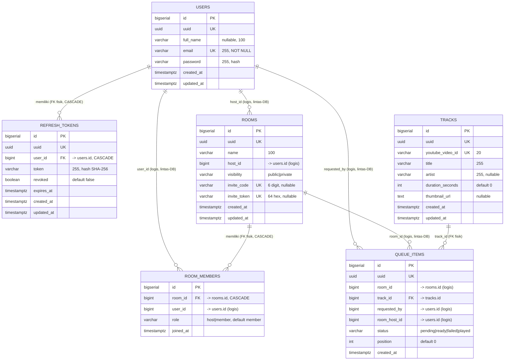

# Listenly — ERD & Analisis Fitur Database

> Dokumen ini diturunkan langsung dari file migration SQL di `migrations/`
> (`000001` – `000007`). Skema menggambarkan backend aplikasi **listen together**
> (mendengarkan musik bersama secara tersinkronisasi).

---

## 1. Catatan Arsitektur Penting

Walaupun semua migration berada dalam satu folder, secara **runtime** tabel-tabel ini
tersebar di **3 database PostgreSQL terpisah** (lihat `config/*.go`):

| Database        | Tabel                              | Dimiliki oleh    |
|-----------------|------------------------------------|------------------|
| `listenly`      | `users`, `refresh_tokens`          | auth-service     |
| `listenly_room` | `rooms`, `room_members`            | room-service     |
| `listenly_music`| `tracks`, `queue_items`            | music-service    |

Akibatnya ada **dua jenis relasi**:

- **Relasi FK fisik** (dalam satu database, `REFERENCES ... ON DELETE CASCADE`):
  - `refresh_tokens.user_id → users.id`
  - `room_members.room_id → rooms.id`
  - `queue_items.track_id → tracks.id`
- **Relasi logis lintas-service** (TIDAK ada FK fisik — di-resolve via gRPC ke auth/room-service):
  - `rooms.host_id → users.id`
  - `room_members.user_id → users.id`
  - `queue_items.room_id → rooms.id`
  - `queue_items.room_host_id → users.id`
  - `queue_items.requested_by → users.id`

Pola umum: setiap entity punya **`id` BIGINT internal** (untuk FK) + **`uuid`** (untuk eksposur eksternal/antar-service).

---

## 2. Entity Relationship Diagram

---

## 3. Rincian Tabel

### `users` (auth-service)
Identitas pengguna. `email` unik, `password` disimpan sebagai hash. `uuid` adalah
satu-satunya identifier yang menyeberang antar-service.

### `refresh_tokens` (auth-service)
Menyimpan refresh token opak **sebagai hash** (`token`), dengan flag `revoked` dan
`expires_at`. Mendukung alur **rotating refresh token** (token lama di-revoke saat
dipakai) dan **logout** yang idempoten. CASCADE delete saat user dihapus.

### `rooms` (room-service)
Room mendengarkan bersama. `visibility` public/private; room private punya
`invite_code` (6 digit) dan `invite_token` (64 hex) yang unik & nullable.
`host_id` menunjuk ke user pembuat room.

### `room_members` (room-service)
Keanggotaan room (many-to-many user↔room). `role` host/member. Constraint
`UNIQUE(room_id, user_id)` mencegah double-join. CASCADE saat room dihapus.
> Catatan presence online TIDAK di tabel ini — disimpan di Redis (`room:{uuid}:online`).

### `tracks` (music-service)
Katalog lagu/video. `youtube_video_id` unik (dedup). Juga di-index ke
Elasticsearch untuk pencarian fuzzy. `duration_seconds`, `thumbnail_url` metadata.

### `queue_items` (music-service)
Antrian lagu per-room. `status` pending/ready/failed/played, `position` untuk urutan.
`requested_by` = user yang meminta, `room_host_id` = host room (untuk cek izin
hapus). FK fisik hanya ke `tracks`.

---

## 4. Fitur yang Bisa Dibangun di Atas Skema Ini

Dikelompokkan: ✅ sudah didukung skema saat ini, �driver kecil (butuh kolom/tabel tambahan).

### A. Sudah didukung penuh oleh skema saat ini ✅
Ini bisa diimplementasi tanpa mengubah tabel — hanya menambah logika/endpoint.

1. **Playback control (play/pause/seek/skip)** — state sudah ada di Redis; sinkronkan
   dengan `queue_items.status` (`ready` → `played`) dan `position`.
2. **Reorder queue** — manfaatkan kolom `position` (drag-drop urutan antrian).
3. **"Now playing" & up-next** — query `queue_items` by `room_id` + `status`, urut `position`.
4. **Riwayat putar (play history)** — item berstatus `played` sudah tersimpan permanen
   (queue_items tidak dihapus), tinggal buat endpoint listing + filter per room/user.
5. **Statistik lagu populer** — agregasi `COUNT(*)` pada `queue_items.track_id`
   (lagu paling sering diminta) atau `requested_by` (user paling aktif request).
6. **Profil & pengaturan user dasar** — update `full_name`, ganti password (tabel users).
7. **Daftar room publik + room milik saya** — filter `rooms.visibility='public'`
   dan join via `room_members.user_id`.
8. **Manajemen sesi/perangkat** — list & revoke `refresh_tokens` milik user
   ("logout dari semua perangkat" = set `revoked=true` semua baris user).
9. **Moderasi queue oleh host** — hapus/skip item; izin sudah bisa dicek via
   `requested_by` / `room_host_id`.

### B. Butuh penambahan kolom/tabel kecil 🔧

10. **Soft-delete / arsip room** — tambah `deleted_at TIMESTAMPTZ` di `rooms`
    (sekaligus memungkinkan "tutup room" tanpa hilang histori).
11. **Transfer kepemilikan / hapus room oleh host** — update `rooms.host_id` +
    `room_members.role`. (Saat ini host dilarang keluar → fitur ini melengkapinya.)
12. **Like / vote lagu di queue** — tabel baru `queue_votes(queue_item_id, user_id, value)`
    untuk fitur "upvote lagu berikutnya" (crowd-DJ).
13. **Favorit / playlist pribadi** — tabel baru `favorites(user_id, track_id)` atau
    `playlists` + `playlist_tracks` (memanfaatkan katalog `tracks` yang sudah ada).
14. **Chat room** — tabel baru `messages(room_id, user_id, body, created_at)`
    (lintas-service: music/room, atau service chat baru).
15. **Ban / kick member** — tambah kolom `status`/`banned_at` di `room_members`.
16. **Ekspirasi / regenerasi invite** — tambah `invite_expires_at` di `rooms`.
17. **Rating / reaksi terhadap lagu** — tabel `track_reactions(track_id, user_id, emoji)`.
18. **Audit / activity log** — tabel `room_events(room_id, user_id, type, payload, created_at)`
    untuk feed aktivitas ("X menambahkan lagu", "Y bergabung").

### C. Ide produk yang lebih besar 💡
- **Rekomendasi lagu** berdasarkan histori `queue_items` (collaborative filtering sederhana).
- **Jadwal / recurring room** (listening party terjadwal) → tabel `room_schedules`.
- **Kolaborasi playlist antar user** memanfaatkan `tracks` + tabel playlist bersama.

---

## 5. Rekomendasi Prioritas

Jika ingin menambah nilai cepat dengan risiko rendah:
1. **Playback sync lengkap** (play/pause/seek) + transisi `ready → played` otomatis — ini inti produk "listen together".
2. **Reorder & vote queue** (kolom `position` sudah ada; voting butuh 1 tabel).
3. **Play history & lagu populer** (zero schema change, pure read API).
4. **Manajemen sesi (list/revoke refresh tokens)** — keamanan, murah dibuat.
